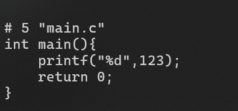
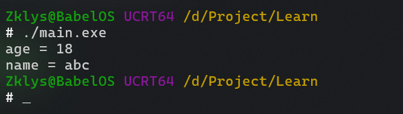
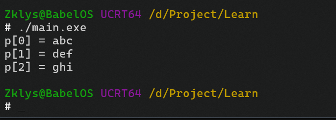
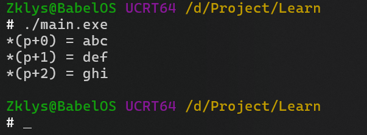
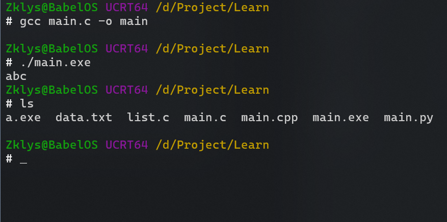

# 从*Hello World*开始
我们可以创建一个`HelloWorld.c`的C语言文件，并在其中填写如下代码。
```c
#include <stdio.h>
int main(){
	printf("Hello World.");
	return 0;
}
```
-  C语言中的所有符号都为英文半角符号。
---
- 编译运行。关于如何编译请参考[GCC](GCC.md)。

如图所示执行程序`hello`在命令行内打印了一串字符`Hello World.`  
注：如果你双击打开程序`hello.exe`可能会看到一个黑窗口一闪而过(正常现象)。  
在程序中添加`getchar();`即可解决。
```c
	getchar();
	return 0;
```
- 位置如上图所示。
## 代码解释
```c
#include <stdio.h>
```
`#include <stdio.h>`是将文件`stdio.h`包含进代码文件中。  
- 而在实际处理的过程中是直接将`stdio.h`文件中的所有内容全部复制进当前文件中。
`#include`是预处理命令，而`<stdio.h>`是C语言的标准库。 
- 在C语言标准库中声明了许多内置的函数。
- C语言中还有很多其他的预处理命令。
---
```c
int main()
```
这是一个函数`int`是它的返回值，`main`是函数名，`()`说明它是一个函数。(对你没看错，就是一对括号。)
- `main`函数是C语言的入口函数，这是C语言规定的。一切程序的代码最初都要从`main`函数开始。
- 这对`{}`括号内的内容就是`main`函数的函数体，就是`main`函数所包含的代码。
- 你现在不必纠结什么是返回值，什么是函数，在之后我会一一写到。
---
```c
printf("Hello World.");
```
如你所见这也是一个函数，是一个位于`<stdio.h>`中的函数。  你所看到的`Hello World.`就是由这个函数所显示出来的。  
>这个函数的作用就是将括号内的东西显示出来。
- 也许你看到了这个函数与我们之前所说的`main`函数有所不同。我们没有书写它的返回值类型，也没有用`{}`括号包裹的代码。(我对于`{}`括号的念法不敢肯定，但是在接下的文章中我会用大括号来称呼。)
- 因为`printf()`是已经被写好的函数，我们这里只是调用(使用)了这个函数。
在括号里的`Hello World.`是我们在调用`printf()`时传入的参数。  
结尾的分号表明语句的结束。(在C语言中每条语句的结束标志都是分号。)  
```c
return 0;
```
`return 0;`对应的是函数的返回值，在调用函数后会返回的数值为`0`。
- 这个`0`对应的就是函数开头的`int`，更多的详细内容在[函数篇](#函数)
在函数遇上`return`语句后函数会结束，并返回`return`语句后的参数。
# 计算并输出两个整数相加
```c
#include <stdio.h>

int main(){
	int num=10;
	int a=3;
	printf("num + a =%d",num+a);
	return 0;
}
```
- 编译运行

- 程序正常地输出了，在下面会详细说明。
## 变量
```c
int num=10;
int a=3;
```
`num`和`a`就是变量。而语句`int num=10;`意为`声明一个整数变量num并赋值为10`。
- 声明就是告诉程序有什么，声明`num`就是告诉程序存在`num`。
- `int`是C语言的关键字，它代表整数类型，通常为4字节，可表达的数字为-$2^{31}$至+$2^{31}$。类似`int`的关键字在C语言中还有很多，我们会在后面的篇章中见到
- `num=10`的过程名为赋值，字面意思。
变量的名字也称为标识符，在C语言中：
- 标识符的`第一个字符`必须是`字母`（a-z或A-Z）或`下划线`（`_`）。
- 标识符的后续字符可以是字母、数字或下划线，但不能包含其他**特殊字符**（如连字符或空格）
- **区分大小写**：标识符是大小写敏感的，例如Variable和variable是两个不同的标识符。
- **不能使用关键字**：标识符不能与C语言的关键字（如int、return等）相同。
既然叫做变量，那么`num`和`a`就是可变的，我们可以更改它的值然后重新输出。
```c
#include <stdio.h>

int main(){
	int num=10;
	int a=3;
	printf("1 num + a =%d",num+a);
	num=5;
	a=6;
	printf("2 num + a =%d",num+a);
	return 0;
}
```
我们在原有的基础上将`num`修改为了5，`a`修改为了6，并且重新编译输出。  

正常输出，但是我们第一次的输出与第二次的输出连接在一起了。为了更加直观我们可以将第一次的输出与第二次的输出分行。  
修改后的代码如下：
```c
#include <stdio.h>

int main(){
	int num=10;
	int a=3;
	printf("1 num + a =%d\n",num+a);
	num=5;
	a=6;
	printf("2 num + a =%d",num+a);
	return 0;
}
```
我们再次编译运行。  

成功执行。关于原因接下来会说到。
## printf()输出
```c
#include <stdio.h>

int main(){
	int num=10;
	int a=3;
	printf("1 num + a =%d\n",num+a);
	num=5;
	a=6;
	printf("2 num + a =%d",num+a);
	return 0;
}
```
相比起单纯的输出`Hello World.`，这次`printf`中的东西开始略显迷惑起来。
- 双引号以及以及其中的内容(`"1 num + a =%d\n"`)是我们给`printf`传入的第一个参数，逗号之后的`num+a`是第二个参数。
- `%d`是`printf`的通配符，它代表了一个整数的占位。在碰到`%d`之后程序会在后面的参数列表按顺序做匹配。  
	- 其中第一个输出语句中的`%d`被替换为了`num+a`的结果`13`。
- `\n`是转义字符，也叫换行符，它表示：在输出到`\n`时进行换行。其他转义字符，我们会在后续讨论。
>其中`num+a`可以视作一个表达式，其代表的是一种行为的结果，并且其并没有对`num`或者`a`做出任何改变。

我们可以将`num + a`赋值给一个新的变量作为输出，如下：  
```c
#include <stdio.h>

int main(){
	int num=10;
	int a=3;
	int tmp=num+a;
	printf("num + a =%d\n",num+a);
	printf("tmp =%d",tmp);
	return 0;
}
```
编译运行  

我们将`num + a`的值赋值给了`tmp`所以两次输出的值相同。(抱歉在第一次写的时候讲`num`写成了`sum`，图片仅有这一处错误，请见谅。)  
我们也可以将两次输出合并为一次输出，如下：
```c
#include <stdio.h>

int main(){
	int num =10;
	int a =3;
	int tmp =num+a;
	printf("num + a=%d tmp =%d",num + a,tmp+1);
	return 0;
}
```
编译执行  

我将`tmp`输出为了`tmp+1`为了从值上，与`num+a`做出区别，以便于理解第一个`%d`与第二个`%d`的匹配结果不同。
# 简单的习题 
2.1：编写一个C语言程序，并输出小明的身份信息。

|姓名|身份|年龄|
|:-:|:-:|:-:|
|小明|学生|18|
并输出15年后小明的年龄。  
运行结果如图：  

>Tips：在`printf()`函数中可以输出中文。如果中文乱码，可以尝试在编译过程中设置为中文编码。（一般为`GBK`）或者可以将输出的显示改为`UTF-8`的编码。
# 习题的答案
```c
#include <stdio.h>

int main(){
  int age=18;//年龄
  printf("姓名: 小明\n身份: 学生\n年龄: %d\n",age);
  printf("15年后小明的年龄: %d\n",age+15);
  return 0;
}
```
- `//注释`双引号后的所有内容都是是注释，注释在编译的过程中会被编译器省略，不作为代码被编译。(行注释)
- `/*这个内容也是注释*/`这是注释的另一种写法。(块注释)
- 优秀的注释也是一个优秀开发者的必备。
# 简单的数据类型介绍
## 整数 
我们在上一节聊过的`int`就是整数类型。还有其他如`long`，无符号`int`之类的，但是在这就不做讨论，有兴趣可以自行差最后啊相关资料。  
整数就是不包含小数点的所有数学数字，如`1`,`123`,`175431`这些都是整数。
在`printf`中匹配`int`的占位符是`%d`。
## 浮点数
浮点数就是我们常说的小数，包括小数点和整数部分的数字。  
在C语言中浮点数分为：单精度浮点数`float`和双精度浮点数`double`。
- `%f`	以小数形式输出单、双精度实数
- `%e`,`%E`	以指数形式输出单、双精度实数  
单精度与双精度的区别就是能表示的小数的位数长度不同，可以用下列程序测试一下：
```c
#include <stdio.h>

int main(){
  float f1=3.141592653;
  double f2=3.1415926538888888888888888888888888;
  printf("f1 =%.9f\nf2=%.25f",f1,f2);
  return 0;
}
```
- `%f`前的`.9`表示要输出到第九位，第二个同理。
编译运行：  

`f1`在第6位之后就开始出错，而`f2`在15位之后才开始出错。但是对应的双精度比单精度的需要更大的内存。  
更为精准的精度在C语言数学库中，不展开介绍。感兴趣可以自行查找相关资料。
## 字符和字符串
在C语言中使用`''`单引号来表示字符，使用`""`双引号来表示字符串。字符是指如`a`,`c`这样的单个字符。字符串是指`Hello`这样的连续字符。  
`char`类型就是字符类型，`string`是字符串类型。  
字符的占位符是`%c`，字符串的占位符是`%s`。  
我们可以编写如下代码来验证输出。
```c
#include <stdio.h>

int main(){
  char ca='a';
  char sa[]="Hello World";
  printf("ca =%c\nsa =%s ",ca,sa);
  return 0;
}
```
- `char sc[]="";`是数组相关内容，我们会在数组篇章进行更深入的学习。
编译运行：  

## 空类型 void
我们会在函数篇章更为经常见到。
常用于没有返回值的空函数。  
- 空函数：返回值为void类型的函数，可以用return，也可以不用return。 不用return和在函数结束处有个return是等效的。  
- 但要注意return后面除了分号以外什么也没有。
## 数组
既然我们之前提到了数组就简单说一下。
数组是按照顺序存储的一系列类型相同的值。整个数组有一个数组名，通过整数下标访问数组中单独的项或元素。
例如：
`float debts[20];`
- 更为详细的内容我们会在数组篇章见到。
## 结构体
结构体是一种自定义的复合数据类型。例如存储学生信息就会用到此种数据类型。
定义：
结构体的关键字是`struct`
```c
struct student
{     
	int id;     
	int age;     
	char name[8]; 
};
```
- 更为详细内容我们会在结构体篇章中见到。
## 共用体
关键字：`union`
共用体也叫联合体，使几个不同类型的变量共占一段内存(相互覆盖)，也就是说共用体的成员共用一片内存。共用体所占内存至少能够容纳最大的成员变量所需的空间。
- 其他请在独立篇章见
## 枚举类型
关键字：`enum`
```cpp
enum Color { RED, GREEN, BLUE };  // 枚举量默认从0开始
Color c = RED;
```
也可以显式指定值。
```cpp
enum Code {a=10,b,c=1,d};
Code cod=b; 
```
这时，`b=11`、`d=2`。
## 指针类型
从根本上看，指针是一个值为内存地址的变量(或数据对象)。在C语言中，指针有许多用法。  
`int *p;`声明一个 `int` 类型的指针` p`   
`char *p`声明一个 `char` 类型的指针` p`  
`int *arr[10]`声明一个指针数组，该数组有10个元素，其中每个元素都是一个指向 int 类型对象的指针  
`int (*arr)[10]`声明一个数组指针，该指针指向一个` int` 类型的一维数组  
`int **p;`声明一个指针 `p` ，该指针指向一个` int `类型的指针  
- 更为详细内容我们会在指针篇章中见到。
# 程序输出
之前我们讨论了输出函数`printf`但输出函数并不只有`printf`。
- 例如输出单个字符的`putchar`。
```c
#include <stdio.h>

int main(){
  putchar('1');
  return 0;
}
```
## 转义字符
|字符|含义|
|:-:|:-:|
`\n` |表示换行
`\t` |表示水平制表符
`\\` |表示反斜杠
`\'` |表示单引号
`\"` |表示双引号
`\r` |表示回车
`\b` |表示退格
`\a` |表示响铃
`\f` |表示换页
`\v` |表示垂直制表符
`\0` |表示空字符
在之前我们已经见过换行符`\n`了，其他的转义字符建议自行尝试了解。
# 程序输入
在用户与程序交互中除去观看程序输出的信息之外，向程序中输入也是必不可少的一环。
输入函数`scanf()`。
示例：
```c
#include <stdio.h>

int main(){
  int tmp=0;
  scanf("%d",&tmp);
  printf("tmp = %d",tmp);
  return 0;
}
```
编译运行，不出意外的话，程序会停在一个空白行等待输入，你输入任意数字后回车，就会打印出你所输入的数字。

程序等待输入，输入12后：


`tmp`被成功赋值为了12，并且正常输出。
- 在`scanf`中也是用占位符匹配变量的。
- 参数列表的变量前面一定要加`&`符号。
`&`符号在在变量前表示的是这个变量的地址。
- 在计算机中所有的数据都会被存储到内存中，数据在内存中的位置就称为地址(实际情况会更为复杂，会有偏移量，映射之类的，但是那样对于新手来说就不会太友好了。)
# 简单习题
4.1：让用户输入两个数字，输出数字的加和。
示例：

# 习题4.1答案
```c
#include <stdio.h>

int main(){
  int tmp=0,tmp2=0;
  scanf("%d %d",&tmp,&tmp2);
  printf("tmp + tmp2 = %d",tmp+tmp2);
  return 0;
}
```
# 运算符
除了常规的：加`+` 减`-` 乘`*` 除`/`之外，在C语言中还添加的有其他的运算符
## `%`取模运算符，表示对两个数相除后的余数。
我们可以设计一个简单的程序输出一下`3 % 2`的数值。
```c
#include <stdio.h>

int main(){
  printf("3 %% 2 =%d",3%2);
  return 0;
}
```
运行结果如图：  

## 自增自减运算符
```c
int tmp=5;
tmp++;//tmp=tmp+1 tmp=6
++tmp;//tmp=7
--tmp;//tmp=tmp-1 tmp=6
tmp--;//tmp=5
```
- 符号在前的称为前自增，符号在后的称为后自增。
- 前自增与后自增的区别为优先级区别。(自减同理)
前置的符号会`先自增/减`，再进行后续操作，而后置符号会先进行优先级更高的符号操作。  
如：
```c
  int tmp=1;
  int n=++tmp+1;
  tmp=1;
  int c=tmp++ +1;
  printf("tmp=%d\nn=%d\nc=%d",tmp,n,c);
```
编译输出：  

我们可以看到`n`与`c`的数值差别就是计算顺序的不同。
## sizeof运算符
sizeof以字节为单位返回运算对象的大小。
例：
```c
int tmp=0;
int n=sizeof tmp;
printf("n=%d",n);
```
编译运行：

`tmp`是一个`int`类型的变量，所以它的字节数就为`4`字节。
```c
sizeof(tmp);
```
这样的写法也是正确的。
## 逻辑与比较运算符
在C语言中可以进行逻辑运算。
- 对于表达式有两种状态，成立与不成立，不成立时为`false`对应值为`0`称为`假值`，在成立时为`true`对应值为`所有不为0的值(但一般会写为1`)称为`真值`。其实就是这俩英文的翻译。
- `false`和`ture`又称为布尔值(`bool`)
例如：
```c
13>7 //在逻辑上成立所以就为真。
7>13 //在逻辑上不成立所以就为假。
```
如上，除了我们常见的比大小与`>=`(大于等于)小于等于同理，之外还有其他的逻辑运算。

|表达式|含义|
|:-:|:-:|
| ==  |两个等号是判断是否相等，单个等号是赋值。
|!=| 叹号加等号是判断是否不等。
|!| 表示反转表达式的逻辑值，将真变假，假变真。又称逻辑非。
|&&|当两个操作数都为真（非零）时，结果为真；否则为假。
| *\|\|* |只要有一个操作数为真（非零），结果就为真；只有当两个操作数都为假（零）时，结果才为假。
- 以上字符均为英文半角符号。
# 循环
如果我们要输出从一到九的所有整数数字，如果不使用循环我们就要写整整9条几乎相同的`printf`语句。如果继续扩大数据量，那会让人绝望的。  
所以我们要使用循环来便捷输出。
## for循环
```c
for(int n=1;n<10;++n){
	printf("n =%d\t",n);
}
```
编译运行：

- 在`for`括号里的就是我们循环的判断条件，以分号为界限。
- 第一个参数`int n=1;`我们声明了一个变量`n`初始化了数值为`1`
- 第二个是一个判断表达式`n<10`，这个表达式有两种状态，成立与不成立，不成立时为`false`对应值为`0`称为假值，在成立时为`true`对应值为`所有不为0的值(但一般会写为1)`称为真值。其实就是这俩英文的翻译。
- 第三个参数为参数更新，用于更新第一个参数的值，然后再在第二个参数进行判断。
所以整个`for`循环的运行逻辑就为：
1. 设置一个判断参数并进行初始化。
2. 对判断参数进行判断，成立则执行循环，失败则结束`for`循环。
3. 执行结束后，执行第三个参数更新判断参数。
4. 重复`2-3`的步骤直到判断不成立结束`for`循环。
## while循环
```c
int n=1;
while(n<10){
	printf("n= %d\t",n);
	n++;
}
```
编译运行：

- 在`while`的括号里只有表达式，当表达式成立时则循环，不成立时停止。
- `while`中需要手动来设定循环的开启和终止条件。
所以整个`while`循环的运行逻辑就为：
1. 判断表达式是否成立，若成立则开始执行循环，不成立则结束循环。
- ### do while
`do while`则是在开始循环之前，先执行一次循环体中的内容。
例：
```c
int n=0;
do{
	printf("%d",n);
	n++;
}while(n>10);
```
很显然0不可能大于10，所以程序只会因为`do while`而执行一次。
如图：

## continue语句
`continue`是跳过本次循环的意思。
```c
int n=0;
do{
	continue;
	printf("%d",n);
	n++;
}while(n>10);
```
我们在执行之前添加了`continue`语句，所以现在程序什么都不会输出。
我们可以修改一下：
```c
int n=0;
do{
	printf("%d\n",n);
	continue;
	n++;
}while(n>10);
printf("n =%d",n);
```
- 我们在执行完输出语句后跳过了本次循环，原本的`n++`会将`n`自增为1，但跳过后`n`仍然为`0`。
- 所以会输出一个0后再输出`n =0`。
编译运行验证：

很好如我们所料。
## break语句
直接跳出循环，或者直接结束循环，怎么理解都可以。
例:
```c
int n=0;
while(1){
	n++;
	printf("n= %d\n",n);
	break;
	n++;
}
printf("n= %d",n);
```
- 在程序中我们直接给`while`一个参数1，所以每次判断都会成立，也就是一个死循环。
- 在第一次运算时我们先对`n`进行了自增为`1`，而后输出了`n`的值，随后我们用`break`语句结束了循环，所以在第二个输出语句时，`n`的值仍然为`1`。
编译运行：

很好，我们的预想很正确。
## 循环嵌套
```c
  for(int n=1;n<=10;n++){
    for(int j=1;j<=10;j++){
      printf("%d * %d = %d\t",j,n,j*n);
    }
    putchar('\n');
  }
```
我们编译运行：

如你所见，这是一个1到10的乘法表。(还不能叫做九九乘法表，因为九九乘法表没有10)
- 在程序中，`j`的每一次循环都是从`1`开始直到`10`，而每一次的`n`的循环都会让`j`从头到尾再次循环一遍。
这个例子主要是用来展示循环是可以嵌套使用的，不只有`for`循环`while`循环也可以，还可以`for`循环和`while`循环组合嵌套使用。  
嵌套也可以有很多层不止有2层嵌套，但每层嵌套，都会让运行时间成指数型增长，所以过多的循环嵌套尽量避免。
在以后的学习中我会展示完整的九九乘法表的输出方法。
# 判断，分支，跳转
## if判断
先看示例：
```c
int n=7;
if(n>0){
	printf("n>0");
}
if(n>100){
	printf("n>100");
}
```
- 判断`if`中的语句是否成立，成立则执行，不成立则跳过。
编译运行：

我们也可以使用`else`
```c
int n=7;
if(n>0){
	printf("n>0\n");
}
if(n>100){
	printf("n>100");
}else{
	printf("n<100");
}
```
当`if`判断不通过时就执行`else`中的语句。
编译运行：

`if else if else`直接看示例
例：
```c
int n=7;
if(n>0){
	printf("n>0\n");
}
if(n>100){
	printf("n>100\n");
}else if(n>5){
	printf("100>n>5\n");
}else{
	printf("n<5\n");
}
```
编译运行：

- 这一大串的`if`与`else`或许让你看的难受，没错我也看着难受，也许是排版问题，在C语言中对于缩进和代码风格没有严格的要求，所以对于排版我们可以选择一个更清晰的。
- 如果你有自己的代码风格，那会是很好的一件事。
```c
int n=7;
if(n>0){
	printf("n>0\n");
}
if(n>100){
	printf("n>100\n");
}
else if(n>5){
	printf("100>n>5\n");
}
else{
	printf("n<5\n");
}
```
- 看着好了一点，但是在编写中我们常常避免过多的`if else`语句，如果一个人的代码中出现很多`if else`，除非有必要原因，不然ta只会是一个糟糕的开发者。  
`else if`是在`if`不通过时，使用一个新的判断来确定。一个`if`可以有很多`else if`，那往往是shi山代码的开端。  
---
我们完成了判断的学习后，我们就可以来完成之前的坑了。
### 九九乘法表
```c
#include <stdio.h>

int main(){
  for(int n=1;n<10;n++){
    for(int j=1;j<10;j++){
      if(n>=j){
        printf("%d*%d=%d\t",j,n,n*j);
      }
    }
    putchar('\n');
  }
  return 0;
}
```
编译运行：

ok成功输出。
- 代码解析？经过前面的学习你应该很轻松就能够看懂这个了，看不懂就回去重新学吧，我也不会推荐你继续向下。
## 分支
先看示例：
```c
#include <stdio.h>

int main(){
	int n=0;
	while(1){
		scanf("%d",&n);
		switch(n){
			case 1:
      printf("你输入了1\n");
			break;
			case 2:
      printf("你输入了2");
			break;
			default:
      printf("你输入了不是1也不是2的任意数字\n");
		}
	}
	return 0;
}
```
编译运行：

- 如你所见，`switch`会判断`n`的值来寻找对应的值来输出，如果找不到就会来到`default`。
- 这里我使用了`while`的死循环来让程序一直运行，不然每一种情况都要执行一次太累了。
- 每一个`case`都代表`n`的一种情况，`case`可以有很多，对应一个`break`。
  - 如果没有`break`作为中断，则在执行的时候会顺序执行到`break`或者末尾。
如图：

- 如果没有`break`，则在我输入1后，程序持续执行了所有语句直到末尾。
## 跳转
`goto`语句。
示例：
```c
#include <stdio.h>

int main(){
	int n=10;
T1:
	printf("n=%d\n",n);
	if(n>1){
		n=0;
		goto T1;
	}
	return 0;
}
```
编译运行：

- 如你所料，goto就是跳转到标记处。
- 但是在程序中尽量，或者不要去使用`goto`。
  - 由于`goto`的标记没有什么过于强硬的标准，所以你可能会看到很多奇奇怪怪的`goto`标记。
  - 而且`goto`语句的功能已经可以使用其他方法进行实现。
  - 你应该也不会想看到几十个`goto`在程序内的好几个标签乱跳吧。
那会是地狱一般的场景，难以维护，难以追踪，难以添加新功能。过了两天之后将再也没有人能够对这份代码动手动脚了。
- 除非你的水平十分之高。
# 函数
在之前的学习中我们见到过很多函数，例如输出函数(`printf`)、主函数(`main`)等等，本篇我们会较为详细的学习函数相关内容。
## 创建并使用简单函数
一个函数的创建需要有，声明，与定义两个过程。
```c
void f_tmp();
```
- 这是一个函数声明。
```c
void f_tmp(){
	printf("In f_tmp.");
}
```
- 这是函数的定义。
完整代码如下：
```c
#include <stdio.h>

void f_tmp();

int main(){
  f_tmp();
	return 0;
}

void f_tmp(){
  printf("In f_tmp.");
  return;
}
```
编译运行结果：  

- `void`声明的函数的返回值为空所以`return`可以返回空值或者不写。
- 我们在主函数中调用了`f_tmp`，之后程序执行了`f_tmp`中的输出语句。
我们可以把函数定义与声明写在一起。
```c
#include <stdio.h>

void f_tmp(){
  printf("In f_tmp.");
  return;
}
int main(){
  f_tmp();
	return 0;
}

```
- 此时`f_tmp`函数一定要写在主函数调用之前，否则在编译时会报出一个编译错误。
## 带参数的函数
我们之前所编写的都是无参函数，直接调用即可，但是无法处理主函数中的数据，所以，我们会使用带参函数。
```c
int sum(int a,int b){
	return a+b;
}
```
这里我们定义了函数`sum`，它的主要作用是，接受两个整数参数，并返回它们的加和。
```c
#include <stdio.h>

int sum(int a,int b);

int main(){
  int i = sum(3,2);
	printf("i= %d\nsum(5,6)= %d",i,sum(5,6));
  return 0;
}

int sum(int a,int b){
	return a+b;
}
```
编译运行：

这里我们先给`sum`传入了3和2，并将sum的返回值赋值给了`i`，然后我们分别输出了`i`和`sum(5,6)`的值。
我们在声明函数`sum`时的函数类型为`int`所以函数的返回值为整数。如果函数类型为`void`那么函数的返回值也应为空。
- 函数的返回值要与函数类型相照应。
## 递归
经过之前的学习，想必对函数已经有了部分的了解。  
程序在执行到函数调用时就进入函数，然后执行函数体代码直至返回。  
在C语言中函数是允许调用自身的。
```c
#include <stdio.h>

int f_tmp(int n);

int main(){
  int nu = f_tmp(0);
  printf("nu = %d",nu);
  return 0;
}

int f_tmp(int n){
	n++;
	if(n<10){
		n = f_tmp(n);
	}
	return n;
}
```
如上所示，在函数`f_tmp`中我们调用了函数自身，然后进入一个新的函数进行数值判断直到一个函数中的`n`等于10于是`if`不成立开始返回到最初的函数，由最初的函数将值返回给`nu`。  
- 在示例中，使用递归看似多此一举，实则就是多此一举，完全可以使用其他手段代替。
- 但是递归是函数中非常重要的部分，所以我使用了一个简单的例子来介绍递归。
## 静态变量
在上述的示例中，我们每一次调用函数时，函数中的内容都会被刷新。如果我们要保留函数中的部分内容，我们可以将其声明为静态变量。
```c
#include <stdio.h>

int tmp();

int main(){
	printf("1 a=%d\n",tmp());
	printf("2 a=%d\n",tmp());
	printf("3 a=%d\n",tmp());
  return 0;
}

int tmp(){
  int a=10;
  a++;
  return a;
}
```

如图，我们每次调用函数时都会覆盖a的值。  
如果想要保留a的数值，并且希望每次调用时都能够对其进行修改，我们就需要静态变量。
```c
int tmp(){
  static int a=10;
  a++;
  return a;
}
```
我们再次运行。

静态变量会在内存中一直存在到程序结束。
# const常量
在之前的学习中，我们见过了很多变量数据，与之对应的，对于不变的量我们称之为常量。
- 普通常量如：`1`、`'a'`等不会改变的数字字符。
- 只读常量，是对于使用`const`修饰的变量。
- 宏常量，是使用`#define`的宏。
```c
#define PAI 3.14 //这是宏
const int a=10; //这是只读常量
```
- 宏的本质是替换，在编译后将`PAI`替换为3.14。
```c
printf("%f",PAI);
```
在运行时就等于:
```c
printf("%f",3.14);
```
---
而只读型常量保留了作为变量的性质，只是将变量属性修改为了只读。  
如果你试图修改，那么就会出现报错。
```c
a=5;
```

如图，编译器报错说明`a`是只读的属性。
- 合理使用`const`能够避免程序意外修改不需要修改的数据。
# 宏
而宏的本质是替换，在编译阶段将对应的字符和指定内容进行替换。
例如：
```c
#include <stdio.h>
#define ABD 123

int main(){
    printf("%d",ABD);
    return 0;
}
```
我们可以预编译一下它。

- 使用`gcc -E`可以看到。
- 预编译中同样可以看到`#include`直接展开成了它内部地所有内容。
- 请忽略掉各种头文件的展开，那并不利于你的学习。
可以看到`ABD`直接被替换为了`123`。
- 同时尽量少或简单地使用宏，因为宏常量只是宏的一种最基本的用法，宏函数，宏参数等等，都是宏可以做的。
- 由于宏的本质是替换原有代表，所以很有可能造成一些意想不到的bug或者其他什么问题之类的，所以尽量少用。
>其他宏的用法请自行查找这边不做介绍。
# 字符与ASCII码

如图，在计算机中一部分的字符，与按键是使用`ASCII`码表所对应的值所存储的。  
我们可以编写程序验证一下。
```c
char ch='c';
putchar(ch);
putchar('\n');
putchar(ch+1);
```
我们编译运行一下

- 字符`c`的`ASCII`码为`99`而`d`的`ASCII`码为`100`，所以字符`c`加`1`之后的输出为`d`。
# 输入输出与缓冲区
我们之前使用`putchar`对单个字符进行输出。输入也可以使用`getchar`来进行输入。  
这些每次处理单个字符的函数，我们称为单字符I/O。  
```c
  char ch;
  while((ch = getchar())!='#'){
    putchar(ch);
  }
```
运行输入：

可以看到程序在检测到`#`后就结束运行。
## 缓冲区
我们在向程序输入的时候，我们输入的数据会先在缓冲区中存储，随后才会被程序接受。
```c
  char ch;
  int n=1;
  while((ch = getchar())!='y'){
    printf("%d\n",n++);
  }
```
我们可以使用这样一个简单的程序直观的观察。

在程序中我仅仅输入了一个字符`a`但程序仍然运行了两次。
- 在敲下回车后，会有一个换行符留在`a`后，因为`getchar`每次都会读取缓冲区的一个字符，所以在读取完字符`a`后又读取到了换行符`'\n'`。
# 作用域
在运行程序时程序内的所有数据都是被暂时存储在内存中的。程序结束就会释放自己所占用的内存。  
```c
void cod(){
  int c=0;
}
int main(){
  cod();
  return 0;
}
```
在函数`cod`中，声明了一个变量`c`，变量`c`的作用范围就仅为`cod`函数中，如果在`main`函数中调用`c`就会报错。同理在`main`函数中声明的变量也不能在其他地方使用。
- 在函数中声明的变量，会随函数调用执行结束而释放，函数调用执行的过程，称为变量的声明周期。
为了在任何函数中都使用变量，我们可以在所有函数外，声明和定义变量。称为全局变量。
```c
#include <stdio.h>
const int a-10;
int main(){
  return 0;
}
```
这样我们就可以在任何地方调用`a`。使用`const`修饰全局变量是为了防止被函数意外修改。
# 类型转换
类型转换就是将存储的一种类型转换为另一种类型。
```c
printf("%c",(char)101);
```
我们将`101`强行显式得转换为了`char`类型，同时使用了字符输出，所以程序会依照对应的`ASCII码`进行输出。

- 程序输出了字符`e`，`e`的`ASCII码`刚好是`101`。
```c
printf("%c",101);
```
如此写也是可以编译通过的，我们并没有显式转换`101`的数据类型。
- 因为发生了隐试转换，编译器将101转换为了`char`的类型。
如果将`double`类型强转为`int`则会丢失小数部分的精度。等等情况
- 请合理并在一定范围内使用类型转换，防止出现数据丢失的情况。
# 数组
数组是一串连续的内存，用于存储数据类型相同的元素。
## 数组的创建与访问。
```c
int cod[10];
```
这就是数组的声明，`cod`是能够存储10个`int`的数组。  
```c
cod[0]=10;
```
我们可以使用`[]`来访问`cod`，每一个元素都有一个标志，称为数组下标。
- 数组的下标从`0`开始。
我们可以编写代码，向`cod`中填入`1~10`的整数，随后输出。 
```c
#include <stdio.h>

int main(){
  int cod[10];
  for(int i=0;i<10;i++){
    cod[i]=i;
  }
  for(int j=0;j<10;j++){
    printf("%d ",cod[j]);
  }
  return 0;
}
```

我们也可以在声明时初始化数组。
```c
int cod[10]={0,1,2,3,4,0,0,0};
int cod[]={0,1,2,3,4,0,0,0};
```
不去写数组长度也是可以的，在编译的时候编译器会自动判断数组长度。  
- 在`C99`标准中，指定可以使用变量作为数组的长度。但不能在程序运行过程中修改数组的长度。
## 多维数组
在刚才的示例中我们声明的仅为1维数组，那样的数据是类似于线性存储的。
```c
int cod[2][2]={
	{1,2},
	{3,4}
};
```
如上，这是一个简单的二维数组。
- 如果我们要访问数据3，则需要`cod[1][0]`来访问。
二维数组可以用来制作一些画面。
```c
#include <stdio.h>

void show(){
  char c[4][32]={
    {"-------------------"},
    {"------1. Exit------"},
    {"-2. 你想要的描述。-"},
    {"-------------------"}
  };
  for(int i=0;i<4;i++){
      printf("%s\n",c[i]);
  }
}

int main(){
  show();
  return 0;
}
```

一个简单的菜单，~~抽象菜单~~。
# 指针
指针是一种特殊的存储变量，它存储的是变量在运行时的地址。*关于地址我们之前简单的在输入篇章讨论过。*  
指针本身并无多么复杂的使用，主要是与其他语法的结合运用。
## 指针的创建与简单应用
```c
int cod=0;
int* p=&cod;
```
这样指针`p`就指向了`cod`了。
- 指针指向的变量必须与自身的数据类型相同。
我们可以输出来看。
```c
printf("&cod=%p\np=%p",&cod,p);
```

这是一串`16进制`的地址，**你不必看懂它是什么**，但是我们可以看得出来指针`p`与`cod`的地址是相同的数。
- 这里是指针`p`的值，并非指针`p`的地址，指针`p`的地址与之并不相同，可以使用`&p`来输出指针`p`的地址。
我们可以使用指针读取和更改变量的内容，同时也可以更改指针的指向。
```c
#include <stdio.h>

int main(){
  int cod=0;
  int* p=&cod;
  printf("1 *p=%d\n",*p);
  *p=10;
  printf("2 *p=%d\n",*p);
  int cod1=9;
  p=&cod1;
  printf("3 *p=%d\n",*p);
  return 0;
}
```

我们分别验证了读取，修改，和转移指向。
## 多重指针
大概就是：**指针的指针，或者指针的指针的指针**等等的形式。
```c
int cod=0;
int *p=&cod; //cod的指针
int **p2=&p; //指针p的指针
int ***p3=&p2;  //指针p2的指针，也是指针p的指针的指针
```
## 空指针
```c
int *p=NULL;
```
这样的指针就是空指针。
- NULL是定义在标准库中的宏。
空指针就是什么也不指的指针。
## 野指针
就是指针指向了错误的内存地址。
```c
  int a[5]={0,1,2,3,4};
  int *p=a;
  printf("%d",*(++p));
```
这里我们用指针指向了数组的第一位，在输出的时候令指针向后偏移一位。
- 如果我们让指针偏移出数组的长度，就会造成程序访问了不该访问的内存地址。
```c
  int a[5]={0,1,2,3,4};
  int *p=a;
  printf("%d",*(p+=10));
```
我们直接让指针向后偏移10位。

程序输出了一个莫名其秒的值。
- 虽然让指针偏移出数组长度在语法中是合法的，但是如果不管制，令指针访问到了危险的内存中，很有可能造成如：系统崩溃、程序崩溃等等的危险行为。
- 请谨记，**`在对内存进行操作时一定要确保在程序的安全范围内。`**
关于[指针深入](#指针深入)。
# 结构体（Struct）
结构体定义与声明
```c
struct cod {   // 显式标签定义
	int a;
};
```
或匿名定义：
```c
struct {            // 匿名结构体
  int x;
}var;
```
## 成员访问与初始化     
```c
#include <stdio.h>

struct Cod{
  int a;
};
int main(){
  struct Cod cod;
  printf("cod.a=%d\n",cod.a=10);
  return 0;
}
```

我们可以使用如上代码来访问，和初始化结构体变量。  
也可以使用其他初始化的方式。
```c
struct Student s = {101, "Alice", 90.5}; // 顺序初始化
struct Student s2 = {.name = "Bob"};      // C99指定初始化器  
```
-  ### 结构体嵌套
```c
struct Date {
  int year, month, day;
};
struct Person {
  char name[20];
  struct Date birthday;  // 嵌套定义
};
```
- 这样的嵌套结构体也是被允许的。
# 联合（Union）
联合可以理解为所有成员共享同一内存空间的结构体。    
```c
union Data {
  int i;
  float f;
  char str[20];
};
```
内存空间的大小由最大的成员决定。
- 任意时刻仅一个成员有效。
   - 由于共享同一片内存所以在使用其他数据时，之前的数据会被覆盖。
- 个人编写和整理，如有错误可以私信指正，非常感谢！
# 内存
在程序运行时，为程序分配的内存大致可分为两类。
- 堆内存：动态分配内存。
  - 手动分配释放（由程序员管理），空间较大（取决于系统资源），存取速度比栈略慢。
- 栈内存：局部变量、函数参数。
  - 自动分配释放（由编译器管理），空间较小（Linux默认8MB），存取速度快。
C语言的动态内存管理函数

|函数|功能|
|:-:|:-:|
|**`malloc`**|	分配未初始化内存
|**`calloc`**|	分配并将内存初始化为0	
|**`realloc`**|	调整已分配内存大小
|**`free`**|	释放动态内存
分配的内存会返回内存的地址，所以需要指针来接受。
```c
#include <stdio.h>
#include <stdlib.h>
int main(){
  int *i_p1=(int*)malloc(sizeof(int));
  *i_p1=10;
  printf("%d\n",*i_p1); 
  free(i_p1);
  i_p1=NULL;
  return 0;
}
```
一个简单的例子。
- 请不要忘记释放`malloc`分配的内存，以免造成内存泄漏。
- 请不要多次`free`同一块内存。
- 请尽量让所有分配的资源显式释放。
# 多文件编译
在C语言项目中，多文件编译是将多个源文件（.c文件）和头文件（.h文件）组合生成可执行程序的过程。  
这种方法常用于大型项目，以提高代码复用性和维护性。
- 我们常把声明和接口写在头文件中，将功能实现写在对应的源文件中。
我们可以创建一个`cod.h`的文件：
```c
#ifndef COD
#define COD
void tmp();
#endif
```
在`cod.c`文件中
```c
#include <stdio.h>
#include "cod.h"
void tmp(){
	printf("In cod`s tmp.");
}
```
在`main.c`中：
```c
#include <stdio.h>
#include "cod.h"
int main(){
  tmp();
	return 0;
}
```
我们编译运行：

在`cod.h`文件中我们是用`#ifndef`和`#define`以及`#endif`来实现条件编译。
- 在C语言中为了防止一个头文件被重复包含，所以要使用条件编译。
  - 条件编译的原理是判断一个宏是否存在。

|名|作用|
|:-:|:-:|
|**`#ifndef`**|如果宏不存在则编译|
|**`#ifdef`**|如果宏存在则编译|
|**`#endif`**|每一个判断的终点|
在引入头文件的时候使用了`""`。
- `<>`是系统自带的文件，而`""`是用户自己创建键的头文件。
- `<>`只会搜索系统中的文件，`""`会在搜索系统文件后再搜索用户创建的文件。
# 指针深入
在指针的实际应用中我们往往采用的是例如结构体指针，指针返回，多级指针等更深入的用法。
例如：
```c
SeqList* iniList(){
    SeqList *head=(SeqList*)malloc(sizeof(SeqList));    //初始化  
    head->data=0;
    head->next=NULL;
    return head;
}
```
- 一段简单的关于C语言链表的代码。
我们将在这之中学习一些关于C指针的深入用法。
## 结构体指针
如下，我们定义一个结构体`Student`。
```c
struct Student{
	char *name;
	int age;
};
```
如果我们想要从堆上获取内存并且储存变量的话，我们就必须使用指针。
```c
struct Student *stu = (struct Student*)malloc(sizeof(struct Student));
```
同时，我们要对获取的变量进行初始化。
```c
stu->name= "张三";
stu->age = 18;
```
我们可以将其包装成一个函数。
```c
#include <stdio.h>
#include <stdlib.h>

struct Student{
    char *name;
    int age;
};

struct Student* initStu(){
    struct Student *stu = (struct Student*)malloc(sizeof(struct Student));
    stu->age=18;
    stu->name="abc";
    return stu;
}

int main(){
    struct Student *stu=initStu();
    printf("age = %d\nname = %s",stu->age,stu->name);
    return 0;
}
```
编译运行后就可以得到如下结果：

对应的我们应该手动释放掉申请的内存。
```c
free(stu);
```
## 多级指针
一个简单的多级指针，你可以理解成：一个指向指针的指针。
简单说，你可以用理解多维数组的方式来将多级指针拆开来看。
```c
char **p;
```
这个你就可以理解成一个二维的字符串数组。

| 指针  |           *p            | *（p+1）  |
| :-: | :---------------------: | ------- |
| 字符串 | 指向字符串1(也就是一个`char*`的指针) | 指向字符串2； |
```c
char **p=(char**)malloc(3*sizeof(char*));
*p=(char*)malloc(10*sizeof(char));
//与p[0]=(char*)malloc(10*sizeof(char));等价。
*p="abc";
//与strcpy(*p,"abc");等价
```
- 简单解释一下，这里为`**p`创建了3个`char*`的空间，然后为其中一个创建了10个大小的`char`空间。
一个完整的程序实例：
```c
#include <stdio.h>
#include <stdlib.h>

int main(){
    char **p=(char**)malloc(3*sizeof(char*));
    for(int i=0;i<3;i++){
        *(p+i)=(char*)malloc(10*sizeof(char));
    }
    p[0]="abc";
    p[1]="def";
    p[2]="ghi";
    for(int i=0;i<3;i++){
        printf("p[%d] = %s\n",i,p[i]);
    }
    for(int i=0;i<3;i++){
	    free(p[i]);
    }
    free(p);
    return 0;
}
```
- 这里使用了循环和指针的偏移以及下标等不同的方法表示。
运行结果：

或者改为偏移表示：

# 文件操作
## 文件基础
在C语言操作文件主要流程是：
1. 打开文件。
2. 进行操作。
3. 关闭文件。
- 每一次操作都要显式操作。
C语言的文件操作函数

|      函数       | 功能描述        |
| :-----------: | :---------- |
|  **`fopen`**  | 打开文件（需指定模式） |
| **`fclose`**  | 关闭文件        |
| **`fprintf`** | 格式化写入       |
| **`fscanf`**  | 格式化读取       |
| **`fwrite`**  | 块数据写入       |
|  **`fread`**  | 块数据读取       |
|  **`fseek`**  | 移动文件指针      |
|  **`ftell`**  | 获取当前位置      |
打开文件的文件模式

|  模式  |       含义        |
| :--: | :-------------: |
| "r"  |    只读，文件必须存在    |
| "w"  | 写入（覆盖创建），不存在则创建 |
| "a"  |    追加，不存在则创建    |
| "r+" | 读写（文件必须存在），必须存在 |
| "w+" | 读写（覆盖创建），不存在则创建 |
- 任意模式加`b`就是二进制方式进行读写如：`rb`,`wb+`。
```c
#include <stdio.h>
int main() {
    // 正确打开文件
    FILE* pf = fopen("data.txt", "r");  
    // 关闭文件并置空指针
    fclose(pf);  
    pf = NULL;
    return 0;
}
```
- `fopen`也是返回一个文件的地址，所以需要一个`FILE*`文件指针来接受。
## 文件的读取和写入
## 普通读取和写入

```c
#include <stdio.h>
#include <stdlib.h>
int main() {
    FILE *pf = fopen("data.txt", "w+");  //读取
    char *data="abc";
    fprintf(pf,"%s",data);//写入
    fclose(pf);  
    pf = NULL;
    FILE *pf2 = fopen("data.txt", "r");
    char *temp=(char*)malloc(10*sizeof(char));
    fscanf(pf2,"%s", temp);//读出
    printf("%s",temp);//输出
    fclose(pf2);
    pf2=NULL;
    return 0;
}
```
如上运行结果如图：

其中`data.txt`中的内容和我们输入的内容一样为`abc`。
## 更安全的读取和写入
将`fprintf`、`fscanf`改为：
- **`fgets`（安全读取一行）**：读取一行（包含空格），能指定缓冲区大小，**不会溢出**。
- **`fputs`（写入一行/字符串）**：将字符串写入文件。
运行结果和上图一样。
## 二进制读取和输入
```c
#include <stdio.h>
#include <stdlib.h>
int main() {
    FILE *pf = fopen("data.txt", "wb+");  //读取
    char *data="abc";
    fwrite(data, sizeof(char), 4, pf);
    fclose(pf);  
    pf = NULL;
    FILE *pf2 = fopen("data.txt", "rb");
    char *temp=(char*)malloc(10*sizeof(char));
    fread(temp, sizeof(char),4, pf2);//读出
    printf("%s",temp);//输出
    fclose(pf2);
    pf2=NULL;
    return 0;
}
```
使用`fwrite`和`fread`来进行二进制读写。
# 结尾
至此对于C语言的基本语法我们都已经进行了简单的学习。现在你应该可以编写出简单的C语言程序，但是对于实际开发，这只是凤毛麟角，仅仅是入门的开始。  
如果你想要深入C语言，你可以去查看更多有关于C语言进阶的文档或书籍。
- 这只是我对知识点的学习笔记，所以我不会去涉及实际开发。
- 更加深入的内容可以去[数据结构](DataStruct.md)。
- 友情链接[C++](C++.md)。
