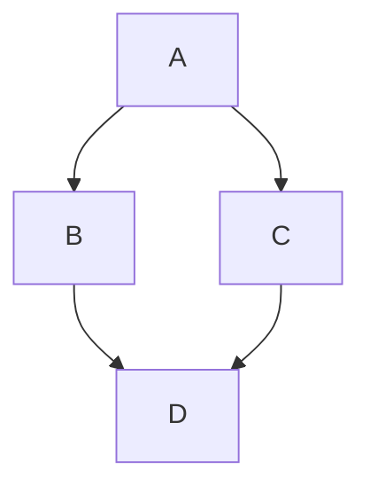

# Markdown
## 标题
- 共有六级标题，由标题文字前的`#`多少来区分
```md
# 一级标题
## 二级标题
```
### 替代语法：
```md
一级标题
===
```
```md
二级标题
-------
```
## 文本样式
```md
*斜体文本* 或 _斜体文本_
**粗体文本** 或 __粗体文本__
***粗体斜体*** 或 ___粗体斜体___
~~删除线文本~~
==高亮文本== (部分解析器支持)
```

*斜体文本* 或 _斜体文本_
**粗体文本** 或 __粗体文本__
***粗体斜体*** 或 ___粗体斜体___
~~删除线文本~~
==高亮文本== (部分解析器支持)
## 段落和换行
```md
这是一个段落。

这是另一个段落（空行分隔）

行末两个空格  
实现强制换行
```
- 这个其实没啥可说的
## 列表
### 无序列表
```markdown
- 项目一
- 项目二
  - 子项目一
  - 子项目二
* 另一种符号
+ 又一种符号
```

- 项目一
- 项目二
  - 子项目一
  - 子项目二
* 另一种符号
+ 又一种符号
### 有序列表
```markdown
1. 第一项
2. 第二项
3. 第三项
```
1. 第一项
2. 第二项
3. 第三项
### 任务列表
```markdown
- [ ] 未完成任务
- [x] 已完成任务
```
- [ ] 未完成任务
- [x] 已完成任务
## 链接
```markdown
[内联链接](https://example.com)
[带标题的链接](https://example.com "标题文字")

引用式链接：
[链接文字][引用标识]

[引用标识]: https://example.com "可选标题"

直接URL：<https://example.com>
```
[内联链接](https://example.com)
[带标题的链接](https://example.com "标题文字")

引用式链接：
[链接文字][引用标识]

[引用标识]: https://example.com "可选标题"

直接URL：<https://example.com>
## 图片
- 图片建议自行试用
```markdown


引用式图片：
![替代文字][图片引用]

[图片引用]: 图片地址 "标题"
```
## 代码
```markdown
行内代码：`console.log()`

代码块：
​```javascript
function test() {
  console.log("Hello World");
}
​```

缩进代码块（4个空格或1个制表符）：
    function test() {
      console.log("Hello World");
    }
```
行内代码：`console.log()`

代码块：

​```javascript
function test() {
  console.log("Hello World");
}
​```

缩进代码块（4个空格或1个制表符）
：
    function test() {
      console.log("Hello World");
    }
## 表格

```markdown
| 左对齐 | 居中对齐 | 右对齐 |
|:-------|:--------:|-------:|
| 单元格 |  单元格  | 单元格 |
| 单元格 |  数据    |   100  |

简写形式：
左对齐 | 居中对齐 | 右对齐
:--- | :---: | ---:
内容 | 内容 | 内容
```

|左对齐| 居中对齐 | 右对齐 |
|:-------|:--------:|-------:|
| 单元格 |  单元格  | 单元格 |
| 单元格 | 数据|   100  |

简写形式：

左对齐 | 居中对齐 | 右对齐
:--- | :---: | ---:
内容 | 内容 | 内容
## 引用
```markdown
> 单级引用
> 多行引用
> 
> > 嵌套引用
> 
> 引用中的**格式化文本**
```
> 单级引用
> 多行引用
> 
> > 嵌套引用
> 
> 引用中的**格式化文本**
## 水平分割线
```markdown
---
***
___
```
---
***
___
## 转义字符
```markdown
\* 正常显示星号
\# 正常显示井号
\[ 正常显示左中括号
```
\* 正常显示星号
\# 正常显示井号
\[ 正常显示左中括号
## HTML 支持
```markdown
可以直接使用 <strong>HTML标签</strong>
<span style="color:red">红色文字</span>
```
可以直接使用 <strong>HTML标签</strong>
<span style="color:red">红色文字</span>
## 脚注
```markdown
这是一个带脚注的句子[^1]

[^1]: 这是脚注的内容
```
这是一个带脚注的句子[^1]

[^1]: 这是脚注的内容
## 定义列表（部分解析器支持）
```markdown
术语一
: 定义一

术语二
: 定义二
: 第二个定义
```

术语一
: 定义一

术语二
: 定义二
: 第二个定义

## 删除线
```markdown
~~删除的文本~~
```
~~删除的文本~~
## 表情符号（部分解析器支持）
```markdown
:smile: :heart: :+1:
```
:smile: :heart: :+1:
## 自动链接
```markdown
https://example.com
contact@example.com
反引号转义
`代码` 显示为 代码
```
https://example.com  
contact@example.com  
反引号转义
`代码` 显示为 代码

## 数学公式（部分解析器支持）
```markdown
行内公式：$E = mc^2$

块级公式：
$$
\int_{-\infty}^{\infty} e^{-x^2} dx = \sqrt{\pi}
$$
```
行内公式：$E = mc^2$

块级公式：
$$
\int_{-\infty}^{\infty} e^{-x^2} dx = \sqrt{\pi}
$$
## 图表支持（部分解析器扩展）
```md



## 注释
```markdown
<!-- 这是注释，不会显示 -->
```
## 嵌入内容
```markdown
![][1]

```

工具推荐
编辑器：VS Code, Typora, Obsidian

注：某些高级功能可能需要特定的Markdown解析器或扩展支持。